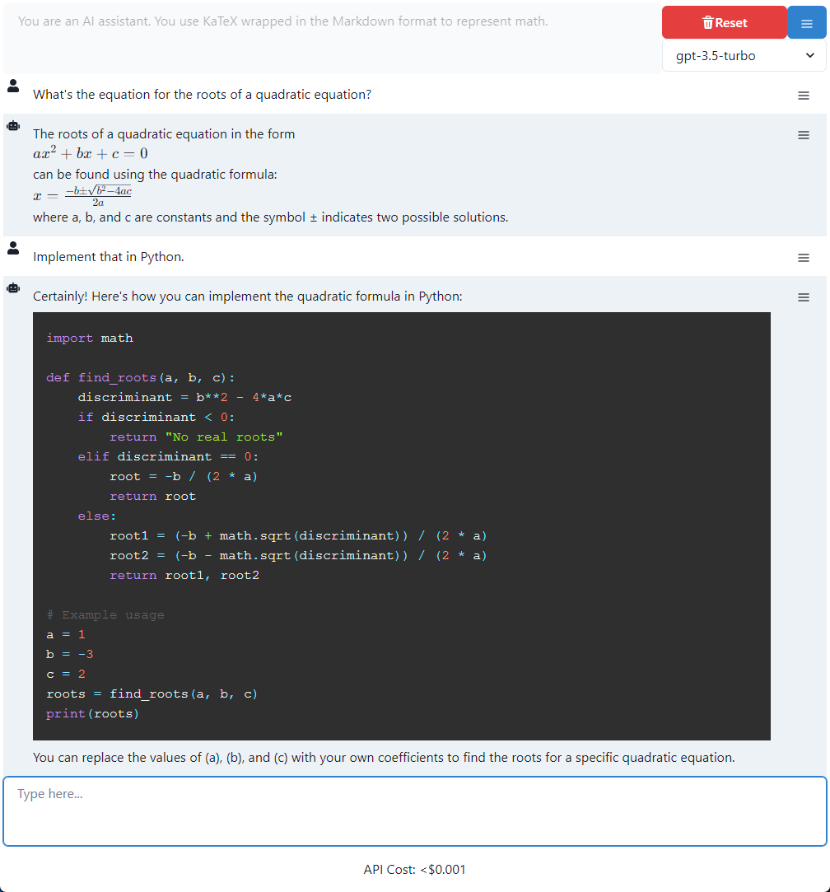

# constructLM

constructLM is a (very) work-in-progress frontend for the OpenAI API that seeks to allow more powerful interfacing with large language models.

### Roadmap

- [x] Basic chat interface
- [x] Markdown
- [x] Code Syntax Highlighting
- [x] Math Rendering
- [ ] Tools specification pane
- [ ] Local tool running specification schema
- [ ] Default tool: read file
- [ ] Default tool: save file
- [ ] Default tool: upgrade model
- [ ] Default tool: OCR
- [ ] Default tool: extract plain text from document
- [ ] File drag support
